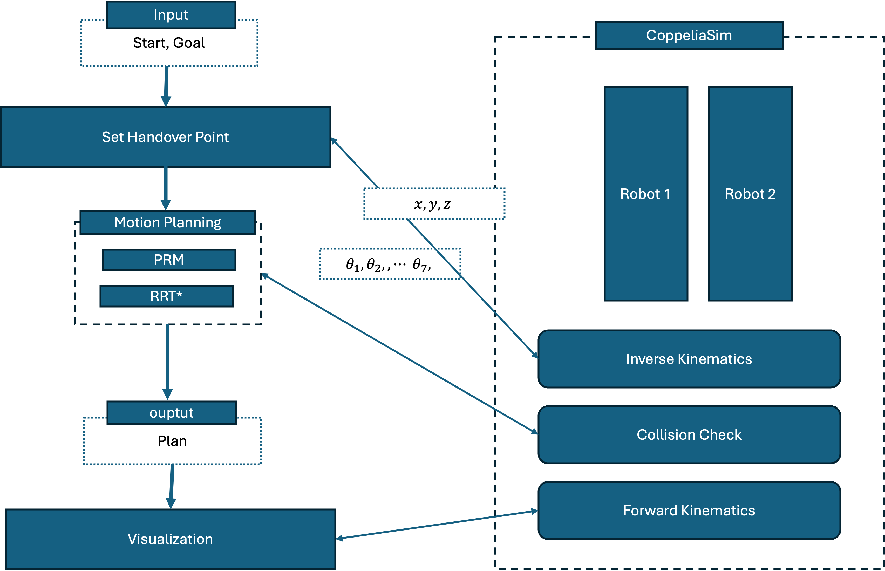
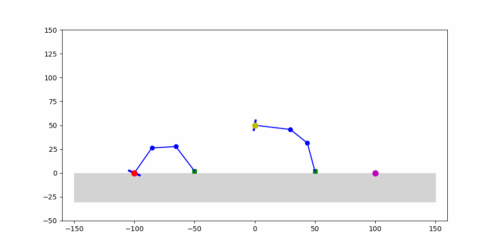
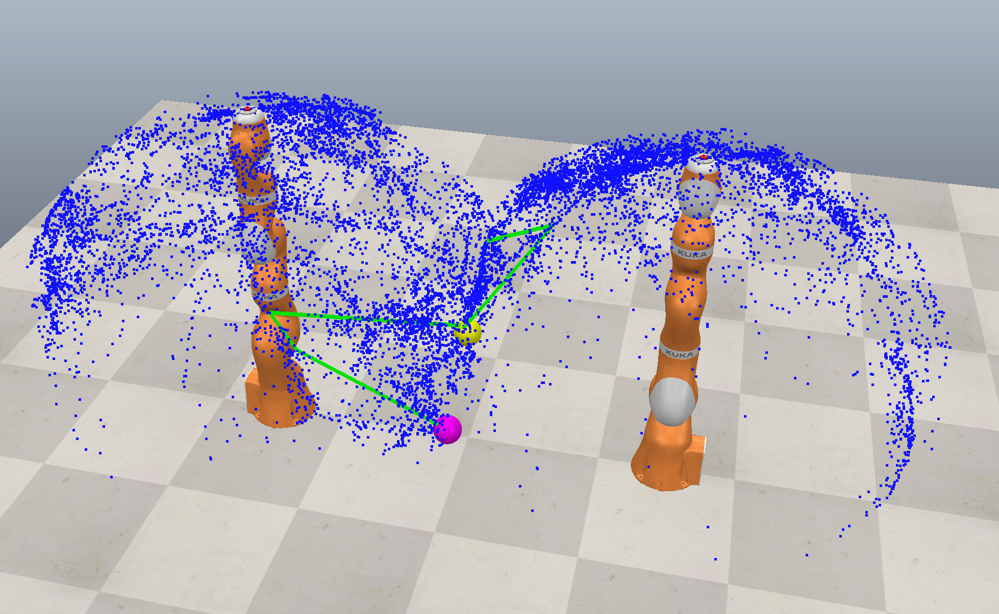

# Robot to Robot Handover

[Motion Planning for Robotic Arm Handover Tasks Using Sampling-Based Methods](https://seongil-heo.com/docs/p-2025mp.pdf) (paper)

Motion-planning experiments for two robotic arms collaborating on a handover task.
The project supports a 2D planar environment from `envs/env.txt` and a [CoppeliaSim](https://www.coppeliarobotics.com/)
scene from `envs/R2R.ttt`.


## Overview



## Robots

<table>
	<tr className="flex w-full">
		<td style="width: 50%;"></td>
		<td style="width: 50%;"></td>
	</tr>
</table>


## Setup

```sh
conda env create -f environment.yml
conda activate r2r-handover
```

For `--problem vrep`, start CoppeliaSim first, open `envs/R2R.ttt`, and run the
scene before launching the Python script.

## Usage

```sh
python run.py [options]
```

Common options:

| Option | Description |
| --- | --- |
| `--method {rrt,prm}` | Planner to run. Default: `rrt`. |
| `--problem PROBLEM` | Environment file path or `vrep`. Default: `envs/env.txt`. |
| `--connect` | Use RRT-Connect. |
| `--bidirection` | Use Bidirectional RRT-Connect. |
| `--star` | Use RRT*. |
| `--num_samples N` | Number of planner samples. Default: `5000`. |
| `--step_length X` | Planner step length. Default: `0.15`. |
| `--connect_prob X` | Goal bias probability. Default: `0.05`. |
| `--local_planner {line,rrt}` | PRM local planner. Default: `line`. |
| `--radius X` | PRM connection radius or RRT* rewiring radius. Default: `2.0`. |
| `--start "x y"` | Override start workspace coordinate. Must be used with `--goal`. |
| `--goal "x y"` | Override goal workspace coordinate. Must be used with `--start`. |
| `--no_draw` | Skip interactive display. |
| `--no_save` | Do not save 2D frames or `assets/robot_motion.gif`. |

Examples:

```sh
python run.py --help
python run.py --problem envs/env.txt --method rrt --connect
python run.py --problem envs/env.txt --method prm --local_planner line --no_draw --no_save
python run.py --problem vrep --method rrt --bidirection
```

## Benchmarks

The benchmark scripts are import-safe and only run when executed directly.

```sh
python experiments/experiment_2d.py --variants rrt connect bidirectional star prm --output_dir results/2d
python experiments/experiment.py --variants rrt connect bidirectional star prm --output_dir results/3d --trace_star --trace_samples 1000
```

Use `--sample_counts 100` for a quick smoke test. `experiments/experiment.py`
requires CoppeliaSim and the remote API scene.

After the CSV files are generated, run `plot.ipynb` to recreate:

```text
assets/result-2d.png
assets/result-3d.png
assets/result-time component.png
assets/result-test&dist.png
```

## Files

| Path | Purpose |
| --- | --- |
| `run.py` | CLI entry point for RRT/PRM runs. |
| `planners/` | RRT, RRT-Connect, Bidirectional RRT-Connect, RRT*, and PRM. |
| `envs/` | Environment files, 2D environment code, collision checks, plotting, and CoppeliaSim wrapper/scene. |
| `experiments/` | 2D and CoppeliaSim benchmark scripts. |
| `assets/` | Generated or reference visual assets. |
| `results/` | Generated benchmark CSV files. |
| `environment.yml` | Conda environment definition. |
| `requirements.txt` | Pip dependency list kept for fallback installs. |
